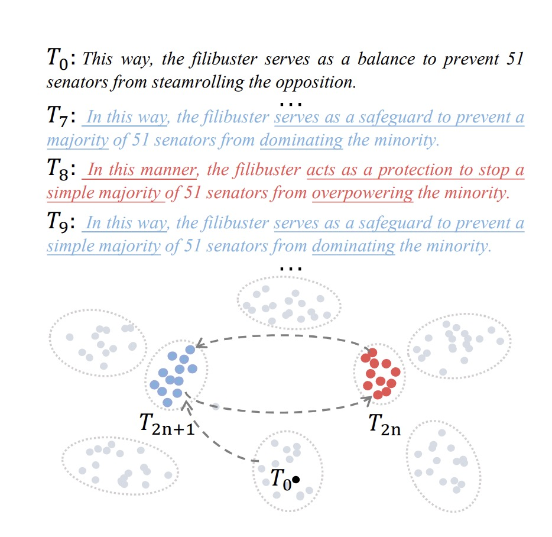

# Unveiling Attractor Cycles in Large Language Models: A Dynamical Systems View of Successive Paraphrasing

This project applies the framework of dynamical systems theory to the behavior of Large Language Models (LLMs).  In dynamical systems, repetitive transformations lead to stable configurations known as attractors. This study uses paraphrasing as a testbed to explore how LLMs converge to stable periodic states, which limit linguistic diversity.
<p align="center">
  
</p>

## Getting Started

You can begin conducting successive paraphrases by running the following script:
```
python paraphrase/main.py
```

The configuration file, located at config/config.yaml, controls which models and datasets are used for paraphrasing. 

**Example `config.yaml`**

```yaml
defaults:
  # The model to use for paraphrasing
  - model: gpt-4o-mini
  
  # The dataset to use for paraphrasing
  - data: paragraph-en

generation:
  # Number of paraphrases to generate per input
  n: 1
  
  # The randomness of the paraphrase generation (0 means deterministic, higher values make the output more random)
  temperature: 0

selector: random  # Options: random, max, min
total_step: 15    # Total number of paraphrasing iterations or steps

# Output directory where the paraphrased texts will be saved
out_dir: ./out-rebuttal-complex-greedy/
```
